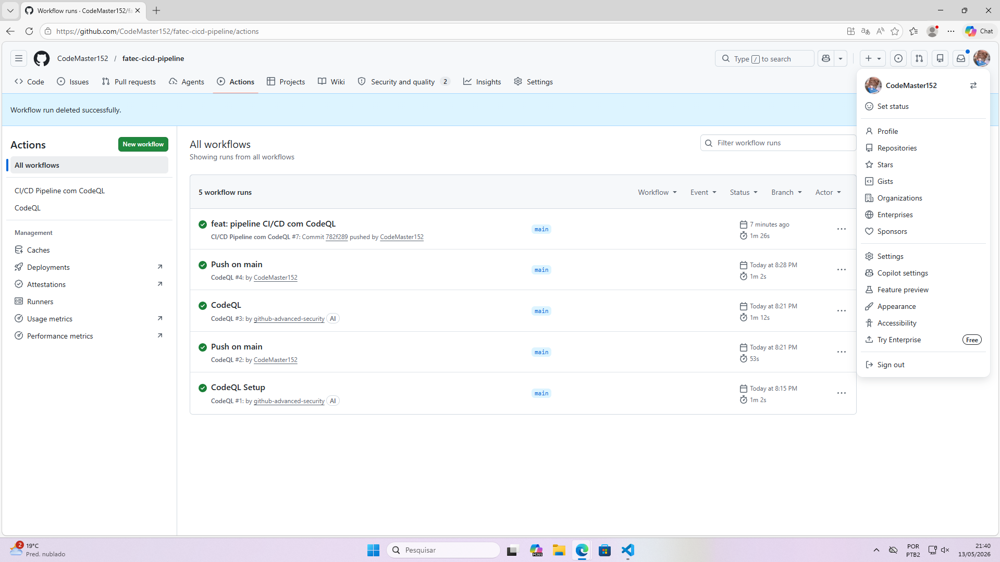
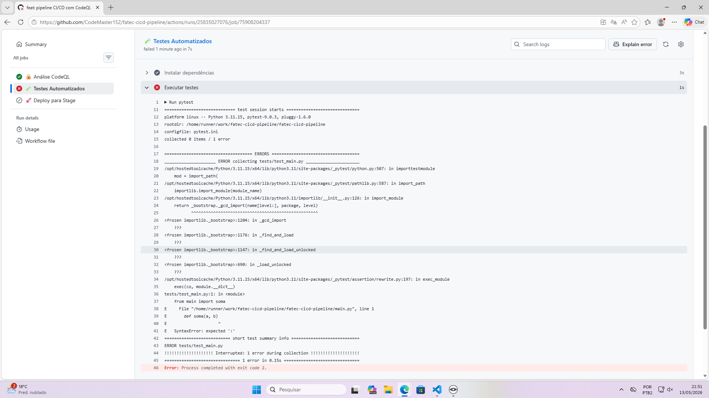

# Pipeline CI/CD com CodeQL

Projeto desenvolvido para a disciplina de Segurança da Informação.

## Tecnologias utilizadas

- Python
- GitHub Actions
- CodeQL
- Pytest
- Flake8

---

## Teste 1 — Pipeline funcionando

---

## Teste 2 — Vulnerabilidade detectada

---

## Teste 3 — Vulnerabilidade corrigida

